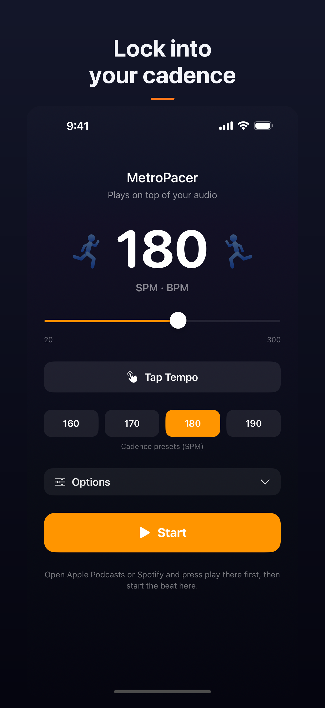
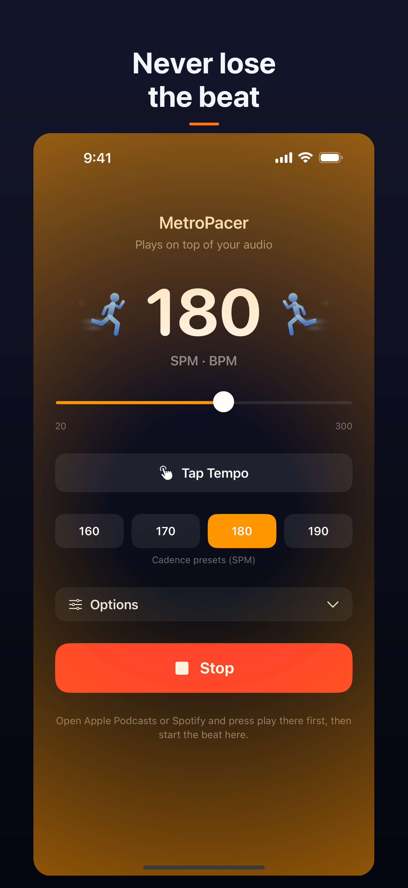
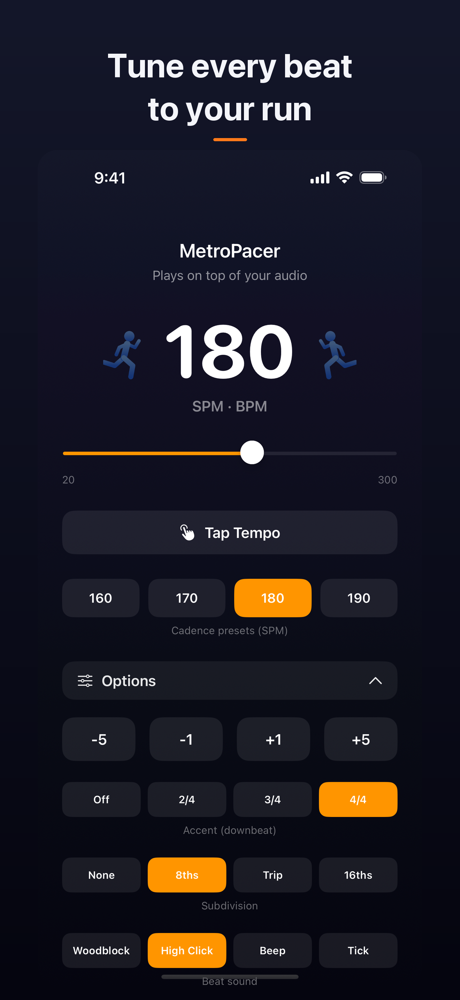

# MetroPacer

A running-cadence metronome for iOS. Set your target steps-per-minute and a steady
click plays **over** your music or podcast, so you can hold your pace without drifting.
Built with SwiftUI.

  
  
  

## Features
- Cadence presets (160/170/180/190 SPM) + full 20–300 range
- **Tap Tempo** — tap along and it sets the pace
- Plays on top of your audio (Apple Music, Spotify, Podcasts) with background playback
- Four click sounds, downbeat accents (2/4–4/4), and subdivisions (8ths/triplets/16ths)
- Independent beat volume, plus **Flash** and **Vibrate** feedback for when the click is hard to hear

## Build & run
Open `MetroPacer.xcodeproj` in Xcode and run on an iOS 18+ iPhone or simulator.

| | |
|---|---|
| Bundle ID | `io.github.bikeusaland.metropacer` |
| Deployment target | iOS 18, iPhone only |
| Apple Team | `D5CC9YCM6F` |

## App Store submission kit
Everything needed to publish lives in [`docs/`](docs/):

| Document | Purpose |
|----------|---------|
| **[APP-STORE-SUBMISSION.md](docs/APP-STORE-SUBMISSION.md)** | 📋 Master step-by-step submission guide — start here |
| [AppStore-listing.md](AppStore-listing.md) | Name, subtitle, promo text, description, keywords |
| [app-privacy-questionnaire.md](docs/app-privacy-questionnaire.md) | App Privacy answers → "Data Not Collected" |
| [app-review-notes.md](docs/app-review-notes.md) | Notes for the App Review team |
| [screenshot-checklist.md](docs/screenshot-checklist.md) | How the screenshots were captured |
| [screenshots/](screenshots/) | 6.9" iPhone screenshots (plain + captioned) |

**Hosted pages** (GitHub Pages, served from `docs/`):
- Support — https://bikeusaland.github.io/MetroPacer/support.html
- Privacy Policy — https://bikeusaland.github.io/MetroPacer/privacy.html

## Status
Repo-side prep is complete. Remaining work is the Apple-account / GUI flow — archiving
with a **released** Xcode and the App Store Connect steps in the submission guide.

## Privacy
MetroPacer collects no data. All settings are stored locally on device; there is no
networking, tracking, or analytics.
