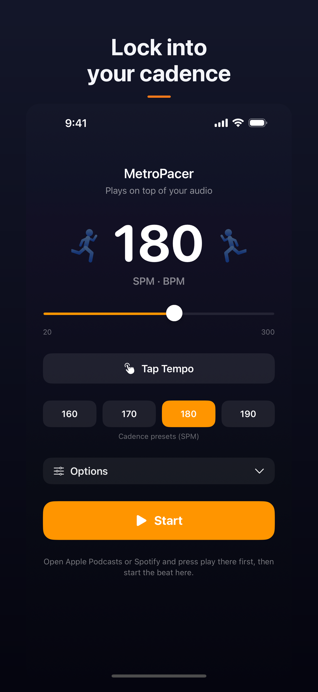
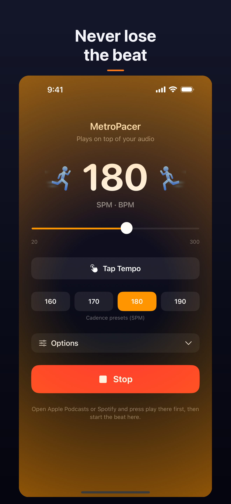
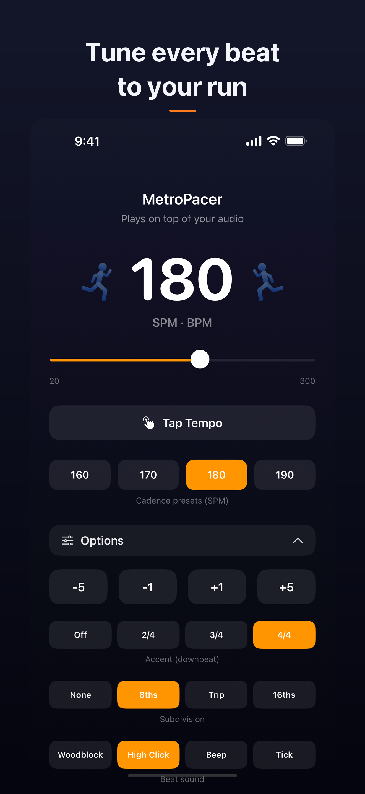

# MetroPacer

A running-cadence metronome for iOS and Android. Set your target steps-per-minute and a
steady click plays **over** your music or podcast, so you can hold your pace without drifting.
Built with SwiftUI (iOS) and Kotlin + Jetpack Compose (Android).

<p align="center">
  
  
  
</p>

## Features
- Cadence presets (160/170/180/190 SPM) + full 20–300 range
- **Tap Tempo** — tap along and it sets the pace
- Plays on top of your audio (Apple Music, Spotify, YouTube Music, Podcasts) with background playback
- Four click sounds, downbeat accents (2/4–4/4), and subdivisions (8ths/triplets/16ths)
- Independent beat volume, plus **Flash** and **Vibrate** feedback for when the click is hard to hear

## Build & run
### iOS
Open `MetroPacer.xcodeproj` in Xcode and run on an iOS 18+ iPhone or simulator.

| | |
|---|---|
| Bundle ID | `io.github.bikeusaland.metropacer` |
| Deployment target | iOS 18, iPhone only |
| Apple Team | `D5CC9YCM6F` |

### Android
Open `android/` in Android Studio, or from the command line (JDK 17 + Android SDK):
```sh
cd android
./gradlew testDebugUnitTest installDebug
```

| | |
|---|---|
| Package | `io.github.bikeusaland.metropacer` |
| minSdk / targetSdk | 26 (Android 8.0) / 36 |
| Release | `./gradlew bundleRelease` (signing: see the Play guide) |

## App Store submission kit
Everything needed to publish lives in [`docs/`](docs/):

| Document | Purpose |
|----------|---------|
| **[APP-STORE-SUBMISSION.md](docs/APP-STORE-SUBMISSION.md)** | 📋 Master step-by-step submission guide — start here |
| [AppStore-listing.md](AppStore-listing.md) | Name, subtitle, promo text, description, keywords |
| [app-privacy-questionnaire.md](docs/app-privacy-questionnaire.md) | App Privacy answers → "Data Not Collected" |
| [app-review-notes.md](docs/app-review-notes.md) | Notes for the App Review team |
| [screenshot-checklist.md](docs/screenshot-checklist.md) | How the screenshots were captured |
| [screenshots/](screenshots/) | 6.9" iPhone screenshots (plain + captioned) |

## Google Play submission kit
| Document | Purpose |
|----------|---------|
| **[PLAY-STORE-SUBMISSION.md](docs/PLAY-STORE-SUBMISSION.md)** | 📋 Step-by-step Play Console guide — signing, closed test, app content, release |
| [PlayStore-listing.md](PlayStore-listing.md) | Name, short + full description, release notes |
| [android/store/](android/store/) | 512px icon, feature graphic, phone screenshots |

**Hosted pages** (GitHub Pages, served from `docs/`):
- Landing page — https://bikeusaland.github.io/MetroPacer/
- Support — https://bikeusaland.github.io/MetroPacer/support.html
- Privacy Policy — https://bikeusaland.github.io/MetroPacer/privacy.html

## Status
**iOS v1.0 live on the App Store since 2026-10-07.** https://apps.apple.com/us/app/metropacer-run-cadence/id6791783261
Android: not yet submitted — see [PLAY-STORE-SUBMISSION.md](docs/PLAY-STORE-SUBMISSION.md).
Landing page: https://bikeusaland.github.io/MetroPacer/

## Privacy
MetroPacer collects no data. All settings are stored locally on device; there is no
networking, tracking, or analytics.
